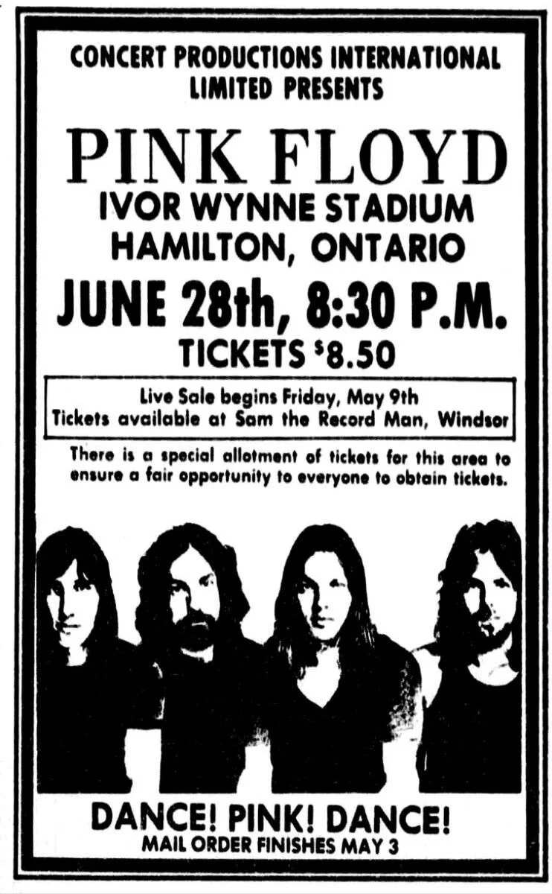
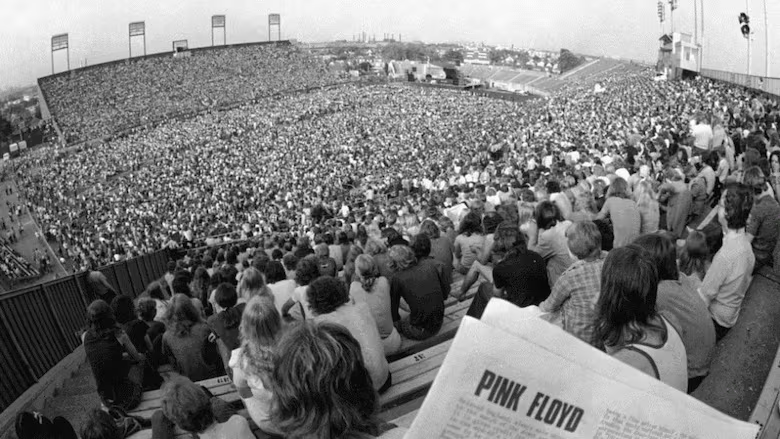

# City of Brantford

I was the city construction inspector for repairs of sewers and paving. All good things to do on a hot humid day in southern Ontario. I learned to not use fruity smelling hair shampoo so I didn't have a cloud of bugs around my head all day. I often chugged a whole stubby of beer when I was done for the day. At that time, some of the Italian crews brought beer in their lunch. It wasn't a big deal then.

I lived with [The Rankins](The%20Rankins.md) who were related to [The Smiths](The%20Smiths.md), our neighbours in Montreal. Small world.

One weekend one of my school friends Gord and I went off to see Pink Floyd in Hamilton.

There were a few people there. CBC reported about 52,000. We were on the field. Somewhere...

Can't believe I found this YouTube video.

<iframe width="560" height="315" src="https://www.youtube.com/embed/fSXZMFq_Msk?si=cU7HG5m17uMxlbNf" title="YouTube video player" frameborder="0" allow="accelerometer; autoplay; clipboard-write; encrypted-media; gyroscope; picture-in-picture; web-share" referrerpolicy="strict-origin-when-cross-origin" allowfullscreen></iframe>

[How rare footage of Pink Floyd concert dubbed 'the Woodstock of Hamilton' made it to the big screen | CBC News](https://www.cbc.ca/news/canada/hamilton/pink-floyd-ivor-wynne-stadium-1975-1.6899142)
