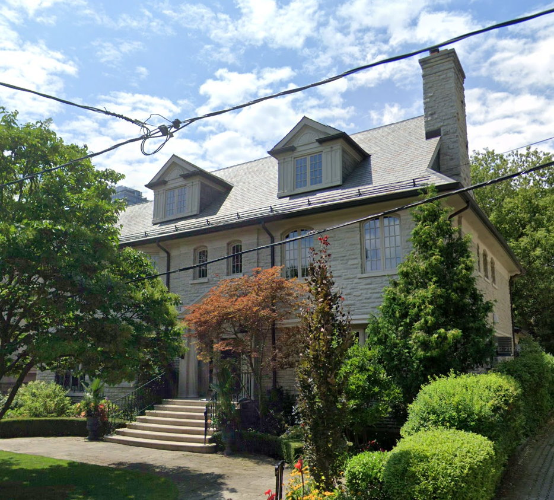

# 2nd coop workterm,  Ontario Housing in Toronto

The Ontario Housing office was at Bay and Bloor St. We'd eat lunch at the CBC studio in Cumberland Terrace in the audience and watch [The Bob McLean Show](https://en.wikipedia.org/wiki/The_Bob_McLean_Show) live. The house band was [Rob McConnell and The Boss Brass](https://en.wikipedia.org/wiki/Rob_McConnell) I saw performances by Anne Murray, Dan Akroyd, B.B. King and lots that I have forgotten, for free.

I lived in the former servants' quarters on the third floor of a mansion on Cluny Drive in Rosedale. The dormer on the right was my room. We shared a kitchen and bathroom.

