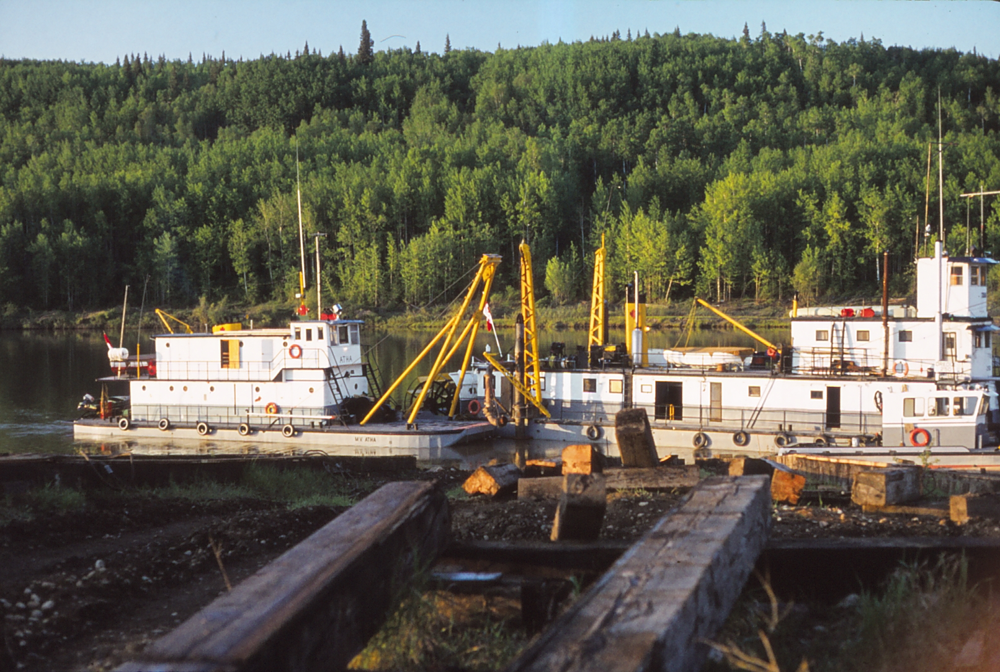

\<% tp.file.last_modified_date() %>

# Syncrude - Northward Developments Ltd.

First time to Alberta

Guy Woodward was on the plane

Ft McMurray was still a rough spot

Riviera Hotel photo...

The highway to the mine site was not yet paved. This was known as Supertest Hill.

It was not unusual to be stopped on the road to Edmonton by the Highway Patrol for a complete vehicle search.

Lived in a house trailer that was provided by Syncrude, across the street from a gravel and concrete plant that ran 24x7.

I worked as an auditor on the development of two apartment buildings, River Lot 5 or as we said, Liver Rot 5. The pay was great. I became a taxpayer that year while still a student.

Explored Alberta with my 3 student colleagues

Visited the Woodwards in Edmonton

Still some evidence from the WWII [Canol Project](https://en.wikipedia.org/wiki/Canol_Project) in Waterways. Equipment and supplies were transferred from NAR trains to barges for the trip down river to Norman Wells.

I had to climb something and the tower construction crane was right there. #ADHD

