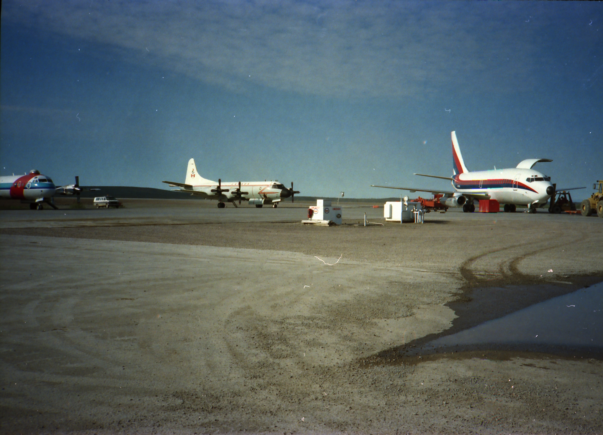

# Buying a 737

C-GENL, the 737 I bought for Imperial, at Edmonton. The aircraft just behind is a [Lockheed CP-140 Aurora](https://en.wikipedia.org/wiki/Lockheed_CP-140_Aurora), a military version of the Electra.

This 737 model was a combi, so part cargo, part passenger and it had a gravel kit so it could land on gravel runways. These were fairly rare. The cost today would be about $100 million. Perhaps my biggest purchase in one go. However our island construction burn rate in today's dollars would be about $3 million a day so we could spend a hundred million in a month or so.

And at Inuvik.

This aircraft ended up flying for an airline in Colombia.

---

# References
