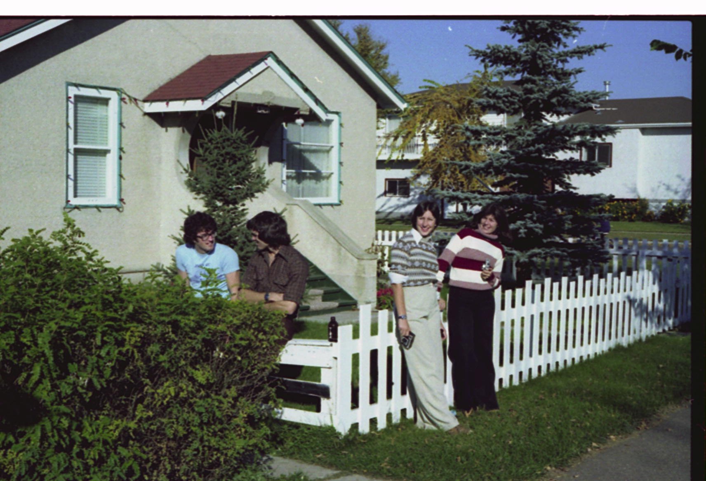

# Disco 92

[11945 92 St NW - Google Maps](https://www.google.ca/maps/place/11945+92+St+NW,+Edmonton,+AB+T5G+1A7/@53.5732888,-113.4872961,16z/data=!3m1!4b1!4m6!3m5!1s0x53a0230ebb33a1bf:0xd8a43c50e3f0fa7!8m2!3d53.5732889!4d-113.4824252!16s%2Fg%2F11jt6jfrgw?entry=ttu&g_ep=EgoyMDI1MDMwNC4wIKXMDSoASAFQAw%3D%3D)
https://maps.app.goo.gl/uFP6HWtsBHZWVatFA

Roommates:
Murray Gadd
The Amazing Elmo was his preferred nick name. Looking back, I bet he had ADHD big time.
Gord
September 2, 2020 5:42 AM journal entry must say something about this.
Gord committed suicide shortly before school ended.
Gord Beaton? Neither Mike or Chris remember his last name

*Mike Curtain*  was in Edmonton for the workterm and stayed with family.
[Chris Hansen](Chris%20Hansen) was in Swan Hills and visited.
[Mike Postons](Mike%20Postons.md) was in Calgary and visited.

