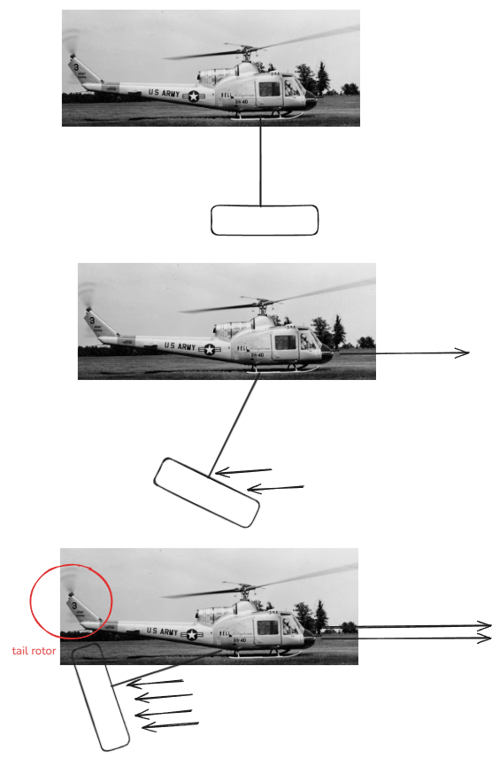

# Hooking the fuel tank to the helicopter

Helicopter portable fuel tank
Needed to test flying it
Flew from the Municipal Airport west of Edmonton where the tank was on a flatbed waiting.
Designed to sling starting in a horizontal orientation, which didn't work well. As the helicopter sped up, the tank drag increased as it swung towards the tail rotor. This flight behaviour was not popular with the pilots.

There is a lot of static electricity generated by rotor blades. I had to be careful and insulated when hooking the tank so I didn't create a ground path. The shock would've thrown me off the truck to the ground and I likely wouldn't be writing this.

---

# References

[Bell 204 - 205](Bell%20204%20-%20205.md)
