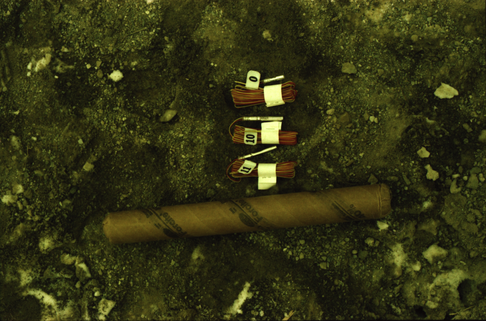
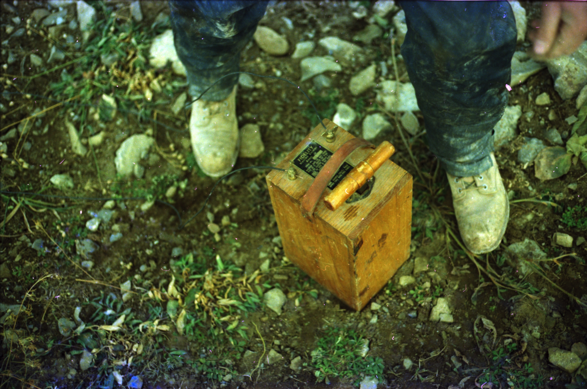
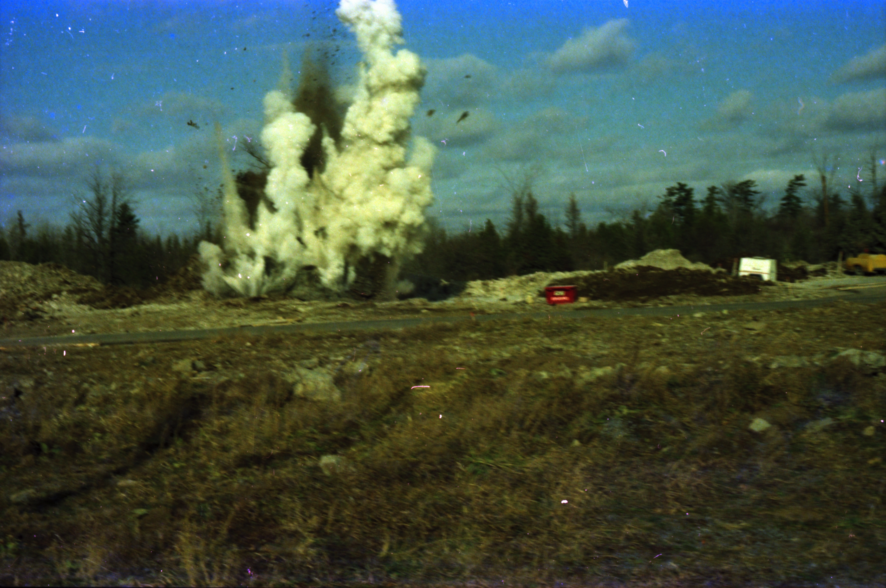
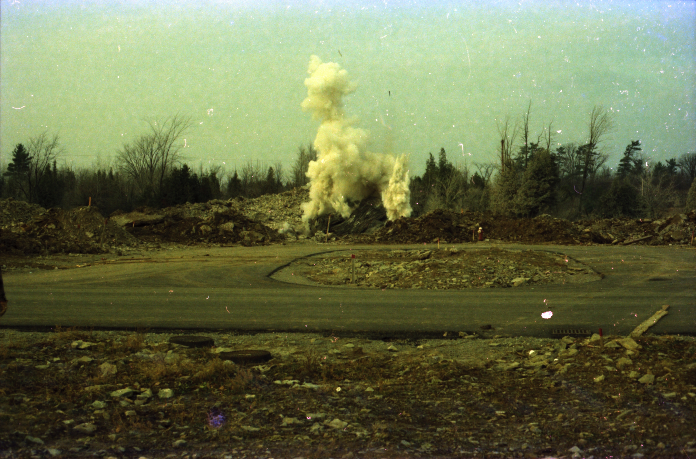
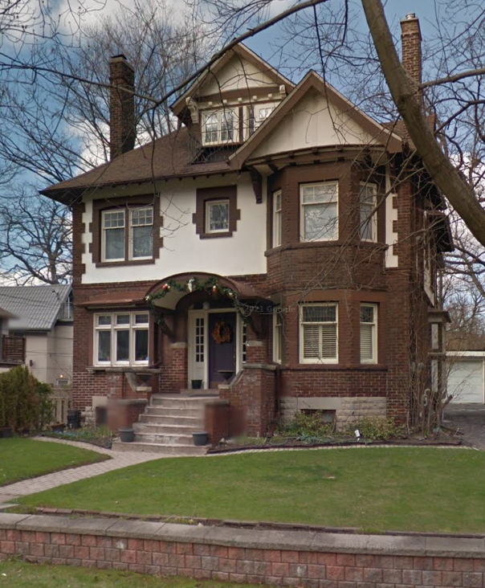

# AKA my 3rd coop workterm, again at Ontario Housing in Toronto

### Carleton Place blasting

I may have watched too many Roadrunner cartoons.

I spent a couple of months minding an Ontario Housing subdivision development in Carlton Place, southwest of Ottawa. It is pretty much on the Canadian Shield. Basements had to be blasted. The idea was to use delay charges to blow the rock out and into a nice pile next to the excavation.

The blasting caps are labelled with millisecond delays.

This is a small electric generator to set off the charges. One thing leads to another...

There many many safety precautions.  Layers of rubber mats were laid over the blast site and these air blasts weren't supposed to happen. They were rare and I somehow caught a couple on camera. We dodged the rocks as they came down. I learned to park my rental car at a distance.

When I wasn't blowing stuff up and in Toronto, I lived in a rooming house in Castle Frank just off Bloor Street. I was in the basement and knew when the Bloor Street subway, which was about 50m from here, started up in the morning.

