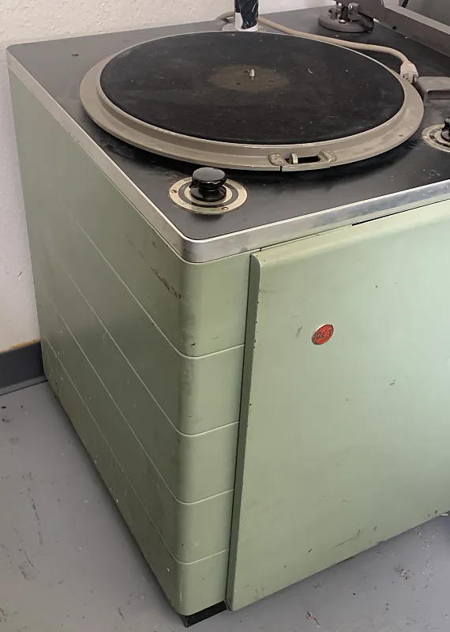

# Radio Waterloo

[CKMS-FM - Wikipedia](https://en.wikipedia.org/wiki/CKMS-FM) was at 94.1 MHz when I was there.

[History | CKMS 102.7 FM – Radio Waterloo](https://radiowaterloo.ca/history/)

In first year engineering I had a weekly 1 hour radio show on the campus radio station.

We had 2 broadcast turntables with clutches so songs could be queued. All manual. I found this photo of what the turntable looked like. They were part of a console, not sitting out like this. I remember the green colour.

