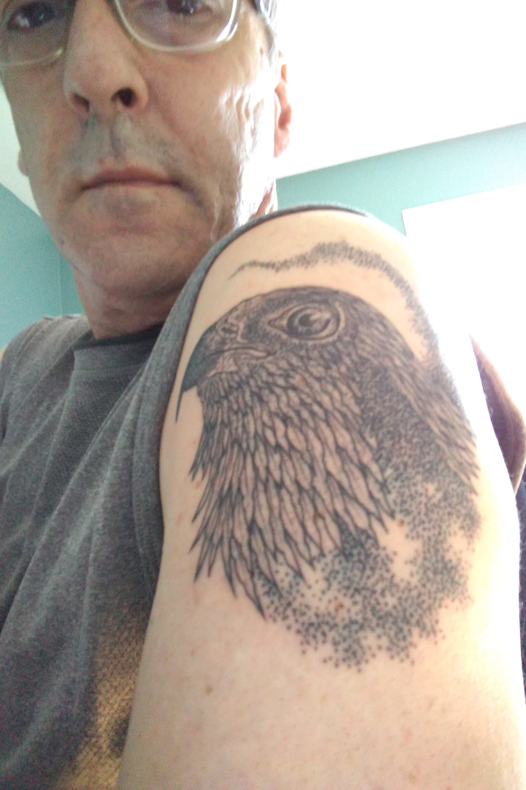
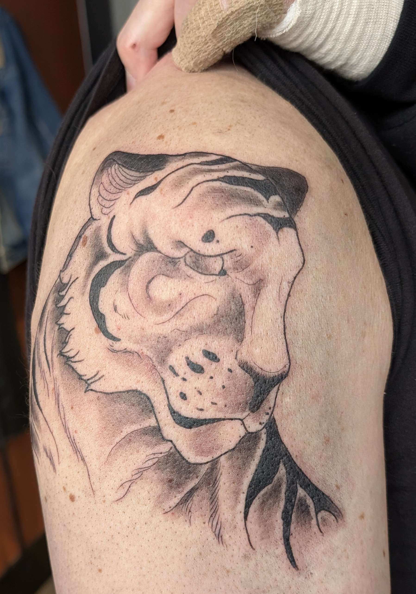

# Tattoos

## Osprey

[Osprey Symbolism - Spirit Animal Totems](https://www.spirit-animals.com/osprey-symbolism/)

An excerpt from one of the sites:

 > 
 > People with the Osprey totem know how to go after what they want. They also know how to hold onto it once they get it. Thus they can **dive deeply into the pools of creativity and draw forth what they need to move forward**. Like the Falcon, folks with this spirit animal have impeccable timing in all matters. They also know exactly when to grab opportunities. These folks tend to treat others with great respect, regardless of how they feel about them. **They always maintain their integrity** even in a clash of wills with another.

I got this tattoo during my first year of addiction recovery. The main symbolism for me is integrity. I also have been creative and think outside the box in my personal life and work.

## Tiger

When Bryant was in elementary school, grade 3, and he bought this carving at a garage sale as a gift for Danielle. Based on the wood it's not local. When we moved into the house in 2006, it was on a shelf in the basement. I pick up on spirits from time to time and I picked up on a tiger spirit hanging out in the basement.

It was somehow connected to our cat at the time, Jerry, who seemed to like reading The Economist.

[Tiger Symbolism - Spirit Animal Totems](https://www.spirit-animals.com/tiger-symbolism/)

The important symbolism to me is patience, protection, strength, focus and persistence. And this is a way for me to honour that Tiger spirit.
